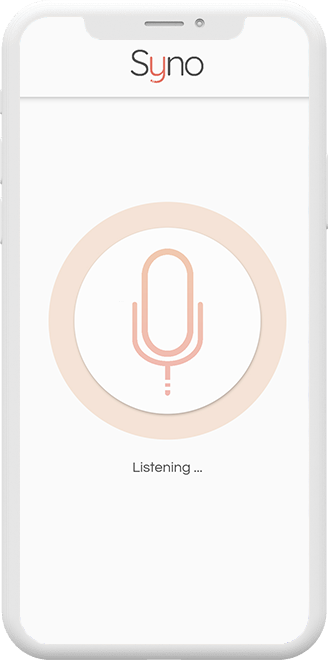
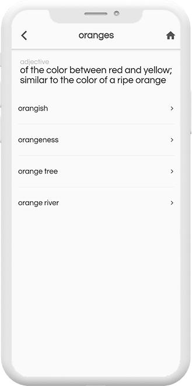
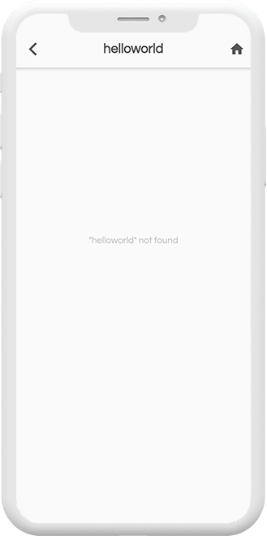

# Syno
Speech transcriber implementing Flutter's native 'Speech-To-Text API' to collect user input (via device microphone) and generating accurate synonyms built with Flutter and Dart.

----
## Screenshots  

----
## Links  
Demo: https://www.youtube.com/watch?v=PF5ZApyPa9o/   
Website: https://syno.juliuskarl.dev/   
Instagram: https://www.instagram.com/syno.nz/   
